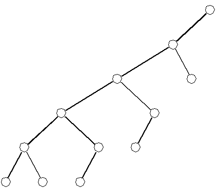

# Unbalanced Binary Search Tree
## What is a Binary Search Tree?
A binary search tree (BST) is a tree comprised of nodes. Each node has exactly two children, where the left child is always less than the parent and the parent is alway less than the right child. The term "balance" comes from scenarios where you could have a long tail of children on one parent node but not the other. Below is a graphical example of an unbalanced tree: 

## How to Run:
Download the file on your machine. Then navigate to the file using your terminal and run the command "python3 Binary_Search_Tree.py" to see an example of the class in action. 

If you would just like to leverage the BST feel free to download only that file and reference it like you would any other built in class. Just make sure you import the file into the code you're using it in.

## Performance Characteristics of the Linked List Class
Methods
- Init: constant time
- Insert_element: linear time
- _recursive_insert: linear time, this is the reason the insert_element method is linear
time. Worst case would be a line of n long down (aka every node only has 1 child) it has
to iterate through the whole tree.
- remove_element: same as insert
- _recurisive_remove: same as recursive insert
- _min_finder: linear time, worst case would be the while loop iterating down a tree with
only a left child per node, so it would have to iterate to the bottom of the tree.
- update_height: constant time, because the value is stored and only needs to be updated
by a constant number of steps.
- in_order: linear time due to the _recursive_in_order method
- _recursive_in_order: linear time because in a worst case scenario would be a perfect
tree, this would require the method to iterate entirely through each node in the
structure, aka linear time.
- pre_order: same as in order
- _recursive_pre_order: same as recursive in order
- post_order: same as in order
- _recursive_post_order: same as recursive in order
- get_height: constant time because the height is already stored as self._size() in my code.
- __str__: linear time, because it is calling in_order. 

## Test Cases
The test cases in the file BST_Test.py can be categorized into three segments: empty tests, insertion tests and removal tests. Within these three categories all of the other methods are sufficiently tested. We do not need to individual test the three different string conversion methods (in_order, pre_order, post_order) or the get_height method because they are used consistently through the entire testing process to ensure each tree is in the correct form after being operated on.
### Empty tests: 
These tests were designed to ensure the the string conversion methods and get_height correctly handled a none-type object. These tests are sufficient because they cover all possible methods of the desired type on an empty tree.

For insertion tests and removal tests it is necessary to test up to a height of 3. This is because it is necessary to test insertion/removal of roots, childless nodes and nodes with children. We only need to go up to height 3 because our methods are recursive, so if they work for a node with children on a tree of height 3 then the method will work in a similar situation on a tree of height n.
### Insertion tests
- Height 1 insertion: adding node to an empty tree. Necessary because if this doesn’t work than cant make a tree, sufficient because all possible tests were conducted.
- Height 2 insertion (less than root, greater than root, perfect tree): adding a node to a tree of height 1. Purpose was to test for failure for any case of adding node to childless node. The three cases, cover all possible types of adding a child to a childless node, and is therefore sufficient.
- Height 3 insertion (less than, greater than, elbow, perfect tree): A tree of height 3 can take significantly more forms than a tree of height 2, thus we didn’t test every possible shape. Instead we focused on four cases. The first three cases would be sufficient to test the class, however we added the perfect tree case as an extra step to ensure that insertion method was working perfectly.

### Removal Tests
- Empty Tests: These tests were necessary to ensure that the removal did not fail on
none-types.
- Height 1 removal: These tests serve as an initial test for removing the root of a tree, this
is vital as without this test a failure in one of our subsequent tests would not have as
clear of cause.
- Height 2 removal (leaf and root): These tests concerned removal of a non-perfect tree of
height 2. Their purpose was to check that the correct order was maintained if either the root or leaf were removed. These tests serve as a useful check before entering into more complicated scenarios.
- Height 2 removal perfect tree (both leaves, right leaf, left leaf, root): These test cases are an extension of the previous test. The most vital and complex test case here is the root removal because it enacts a part of the code in our removal method that had yet to be tested. These tests ensure that the child of a removed node moves to the correct position.
- Height 3 removal (elbow joint): Another test to ensure the child of a removed node is repositioned correctly.
   
- Height 3 perfect tree removal (left child of root, root): The final test. We have previously checked the removal of a node with 1 and 2 children. This test takes these tests further by ensuring that the removal of a node (with children) within a complex tree correctly places the children in their new positions. We did not do a right child or root removal because it follows an identical method to the left child of root removal. The final case, removal of root, checks to ensure that for a large tree the removal of the root creates a tree with the correct ordering.

Due to the recursive nature of operating on unbalanced binary search trees the tests discussed above form a comprehensive and sufficient list of the possible ‘code-breaking’ scenarios.