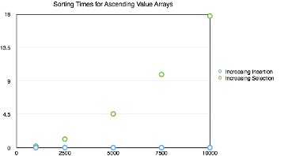
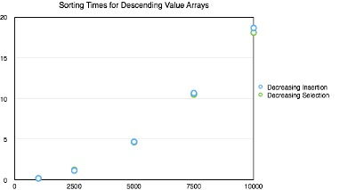
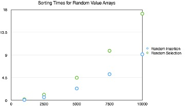

# Selection Vs Insertion Sort
## How to Run: 
Download the file on your machine. Then navigate to the file using your terminal and run the command "python Sort.py" to see the sorting algorithms in action!

## Ascending Values

The graph shows that the insertion sort method is significantly more efficient than the selection sort method in the case of arrays in ascending order.  This is because the insertion sort function compares values adjacent values and as all adjacent values are larger few steps are required per cell.  On the other hand the selection sort method still is forced to iterate from k to n-1 to find the minimum value for each cell. From our explanation and from the visual information provided by the above graph it is not unreasonable to assume that in this case the insertion function is O(1). 

## Descending Values

For descending value arrays the selection method has maintained approximately the same runtime, however the insertion method times have drastically increased.  The selection method times are relatively unchanged because the function iterates through the for and while loop for every value.  The insertion function on the other hand not only has to iterate through both loops but as the array size increases the block of cells it must reposition grows with each iteration.   It is clear from this graph that both functions follow a geometric timing pattern and are therefore not O(1). 

## Random Values

At small random array sizes the timing of the insertion and selection methods are somewhat similar.  However, as the size of the array increases the insertion method becomes significantly more efficient. This is because the insertion method can take advantage of random sets of relatively ordered terms already existing within the random value array whereas the selection method will check cell k through n-1 regardless.  The length of the array is the main factor in the selection method, but the insertion method is influenced by both the length of the array and the composition of the array.  

